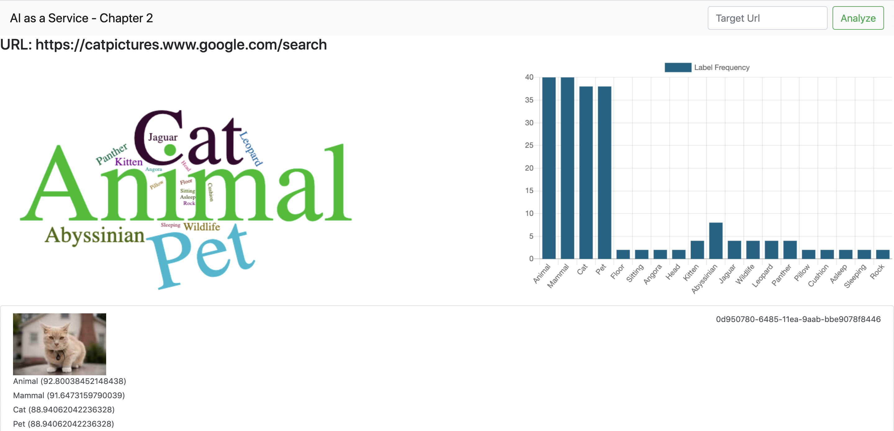

# TL;DR
For the impatient, quick setup instructions can be found here:

# Welcome to the Cat Detector Workshop!
In this workshop we will build a serverless image recognition system on AWS. The system will use a number of AWS technologies including S3, Lambda, SQS and Amazons image recognition AI service Rekognition.

The finished system UI is shown below:

## Prerequsities
For this workshop you will need:

* A development machine with Docker installed [https://docs.docker.com/get-docker]( https://docs.docker.com/get-docker)
* An AWS account
* AWS API access keys: AWS_ACCESS_KEY_ID and AWS_SECRET_ACCESS_KEY

## Time to complete
If you have all of the prerequisites ready to go then this workshop normally takes around 2 hours to complete. But it's not a race!

## Structure
The workshop is divided into 10 easy to follow stages so that you can work along as we build the system.

The steps are:

* [step1-overview](./step1-overview)
* [step2-setup](./step2-setup)
* [step3-serverless](./step3-serverless)
* [step4-infrastructure](./step4-infrastructure)
* [step5-rekognition](./step5-rekognition)
* [step6-crawler](./step6-crawler)
* [step7-analysis](./step7-analysis)
* [step8-ui](./step8-ui)
* [step9-full](./step9-full)
* [step10-wrapup](./step10-wrapup)

There will also be some code to deploy, run and test along the way so grab some coffee, roll up your sleeves and lets get started with [step1](./step1-overview)

## Get in touch
This workshop is brought to you by fourTheorem [https://www.fourtheorem.com](https://www.fourtheorem.com).

You can reach us at: `hello at fourtheorem dot com`

Tweet/DM us at: @pelger, @eoinsha

Linkedin: [https://www.linkedin.com/in/peterelger/](https://www.linkedin.com/in/peterelger/)

